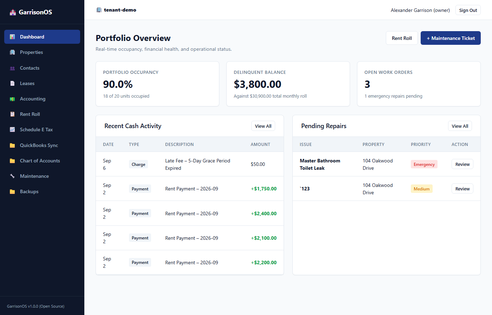

# GarrisonOS

> An open-source, modular, zero-dependency, lightweight property management framework designed to liberate property managers from closed vendor lock-in, inflexible data schemas, and proprietary software silos.

[](LICENSE)
[](#pre-production-disclaimer)
[](https://nodejs.org/)
[](https://www.php.net/)
[](#dependencies--runtime-prerequisites)
[](#architectural-principles)

---

> [!WARNING]
>
> ## Pre-Production Disclaimer
>
> GarrisonOS is currently in **pre-production prototyping** and active development. This software is **not ready for production use and should not be installed or deployed by end users** until an official, stable release is made available. Core APIs, internal schemas, and functionality remain subject to breaking changes without notice. Developers and contributors are welcome to explore and test the codebase in isolated development environments.

---

## Overview

GarrisonOS is engineered to provide self-managing landlords, independent property managers, and small real estate operators with a modern, privacy-respecting, self-hosted property management suite.

The software addresses day-to-day operational tasks, cash-basis accounting, and structured recordkeeping without the recurring subscription costs, vendor lock-in, or opaque data silos imposed by legacy property management platforms.

Built from first principles around **zero external runtime dependencies**, GarrisonOS operates entirely on the standard libraries of Node.js and native PHP, backed by an embedded SQLite engine operating in Write-Ahead Logging (WAL) mode.

---

## Target MVP Scope

The GarrisonOS MVP is focused strictly on delivering a self-hosted property management suite tailored for **small residential portfolios (up to 50 units)**, including single-family residences, duplexes/triplexes/fourplexes, small multifamily buildings, and scattered sites.

### In Scope for MVP

* **Day-to-Day Operations**: Physical property structures, rentable unit inventories, status lifecycle tracking, human directory management (tenants, owners, vendors, emergency contacts), and maintenance work order dispatching.
* **Lease Agreements**: Residential lease lifecycles, terms, security deposit tracking, and multi-party signatory assignments.
* **Native Double-Entry General Ledger & Accounting**: Native, immutable double-entry journal engine (`journal_entries` and `journal_lines`) enforcing balanced zero-sum debit/credit invariants, Chart of Accounts mapped to IRS Schedule E categories, Trial Balance verification, tenant running balances, automated monthly rent charge generation with mid-month proration, waterfall payment allocation, move-out deposit disposition, and streamed exports (Rent Roll, Schedule E P&L, tenant ledgers, QuickBooks QBO/IIF/OFX).
* **Self-Hosting & Privacy**: Single-tenant or multi-tenant deployment, local SQLite database storage, and complete data portability.

---

## Architectural Principles

1. **Zero External Runtime Dependencies**:
   * **Backend Engine**: Built exclusively on native Node.js standard modules (`node:http`, `node:sqlite`, `node:crypto`, `node:async_hooks`, `node:events`, `node:fs`, `node:path`, `node:test`, `node:assert`). No npm packages at runtime (no Express, Fastify, Prisma, TypeORM, Zod, uuid, or bcrypt).
   * **Frontend Presentation**: Built exclusively on native PHP 8.2+ with standard built-in extensions (`pdo_sqlite`, `curl`, `session`, `filter`) and semantic HTML5 with vanilla CSS Custom Properties. No Composer packages, CSS preprocessors, or frontend JavaScript frameworks.
2. **Strict Multi-Tenancy & Row-Level Isolation**:
   * Every operational database table includes a `tenant_id TEXT NOT NULL` column referencing `tenants(id)`.
   * Tenant context is extracted from request headers (`X-Tenant-ID`) or authenticated session tokens and propagated down the execution stack using `AsyncLocalStorage`.
   * Repositories and business logic resolve `tenant_id` implicitly from execution context—never from untrusted request bodies or URL parameters.
3. **Financial Precision & Tax Alignment**:
   * All currency values are strictly stored and calculated as **INTEGER cents** (e.g., $1,450.00 is stored as `145000`). Floating-point arithmetic for currency is strictly prohibited.
   * **Native Double-Entry General Ledger**: Immutable, append-only bookkeeping engine (`journal_entries` and `journal_lines`) requiring every transaction to satisfy $\sum \text{Debits} \equiv \sum \text{Credits} > 0$. Corrections are posted exclusively via explicit reversal entries.
   * Standard Chart of Accounts mapped to standard IRS Form 1040 Schedule E expense categories for tax preparation, Net Operating Income (NOI) calculation, and QuickBooks integration.
4. **Deterministic Identity & Time Standards**:
   * **Primary Keys**: RFC 9562 **UUIDv7** (time-ordered 128-bit UUIDs generated natively via `node:crypto.randomBytes`).
   * **Timestamps**: Stored strictly as **INTEGER milliseconds** (UTC epoch ms via `Date.now()`).
   * **Soft Deletes**: Standardized `deleted_at INTEGER` timestamp column across all entity tables (`NULL` when active).
5. **Decoupled API-First Architecture**:
   * The core Node.js engine exposes a zero-dependency HTTP REST API.
   * The native PHP frontend communicates with the engine via internal loopback HTTP requests, forwarding user session context, authentication tokens, and tenant headers.
6. **Drop-in Modularity**:
   * Domain features are encapsulated in self-contained directories under `modules/[module_name]/` containing their own migrations, backend routes, event subscribers, repositories, and frontend views/hooks.

---

## Dependencies & Runtime Prerequisites

GarrisonOS is intentionally architected with **zero external runtime package dependencies**.

### Backend Engine

* **Runtime**: [Node.js](https://nodejs.org/) `v22.5.0` or newer (`v24.x LTS` recommended for built-in `node:sqlite` support).
* **Standard Library Modules Utilized**:
  * `node:http`: Low-latency HTTP server, custom streaming JSON parser, and REST router.
  * `node:sqlite`: Synchronous embedded SQLite database engine with WAL mode and transaction wrapper.
  * `node:crypto`: RFC 9562 UUIDv7 generator, `scrypt` password hashing with salt, and HMAC-SHA256 token signing.
  * `node:async_hooks`: `AsyncLocalStorage` tenant context store.
  * `node:events`: In-process asynchronous `EventBus` for cross-module events.
  * `node:fs` / `node:fs/promises`: Local disk file storage driver and dynamic module loader.
  * `node:path`: Filesystem path normalization and traversal prevention.
  * `node:test` & `node:assert`: Native automated test runner and assertion library.
* **Build-Time Development Dependencies** (zero runtime footprint):
  * `typescript` (`^5.8.0`): Static typing and compilation to ES2022 JavaScript.
  * `@types/node` (`^24.0.0`): TypeScript definitions for Node.js standard modules.

### Frontend Presentation Layer

* **Runtime**: [PHP](https://www.php.net/) `8.2` or newer.
* **Standard PHP Extensions Required**:
  * `curl`: HTTP client for backend REST API communication.
  * `session`: Secure session management and CSRF token persistence.
  * `filter`: Input validation and sanitization.
  * `pdo_sqlite`: Standard SQLite database driver extension.
* **Client-Side Stack**:
  * Semantic HTML5.
  * Vanilla CSS with CSS Custom Properties (supports Light and Dark themes).
  * Minimal progressive enhancement JavaScript (no client-side build pipeline required).

### Storage & Database

* **Database**: Embedded SQLite 3 (managed natively via `node:sqlite`).
* **Database Modes**: Write-Ahead Logging (`PRAGMA journal_mode = WAL`), Foreign Key enforcement (`PRAGMA foreign_keys = ON`), Busy Timeout (`PRAGMA busy_timeout = 5000`).
* **File Attachments**: Local disk storage partitioned by year, month, and UUID.

---

## Target MVP Capabilities



```text
┌────────────────────────────────────────────────────────────────────────┐
│                              GarrisonOS                                │
├──────────────┬──────────────┬──────────────┬─────────────┬─────────────┤
│  Properties  │   Contacts   │    Leases    │ Accounting  │ Maintenance │
│ & Portfolios │  Directory   │  Agreements  │  & Ledger   │ Work Orders │
└──────────────┴──────────────┴──────────────┴─────────────┴─────────────┘
```

### 1. Properties & Portfolios (`modules/properties`)

* **Legal Portfolios**: Organize holdings by legal entity / LLC with tax identification.
* **Physical Properties**: Manage Single-Family Homes, Multifamily Buildings, Condominiums, Townhouses, and Commercial spaces with address, year built, and metadata.
* **Rentable Units**: Track unit inventories, unit numbers, bedroom/bathroom configurations, square footage, market rent, and target deposits.
* **Unit Lifecycle States**: `vacant`, `occupied`, `notice_given`, `turnover`, and `maintenance_hold`.

### 2. Contacts Directory (`modules/contacts`)

* **Unified Humans Directory**: Centralized management of tenants, property owners, maintenance vendors, co-signers/guarantors, prospects, and emergency contacts.
* **Vendor Profiles**: Specialization tracking (plumbing, electrical, HVAC, general repair, roofing, turnover cleaning).
* **Communication & Identity**: Primary/secondary phone numbers, email addresses, tax IDs, and entity linkages.

### 3. Lease Management (`modules/leases`)

* **Contract Lifecycle**: `draft` $\rightarrow$ `active` $\rightarrow$ `expiring` $\rightarrow$ `renewed` $\rightarrow$ `terminated` / `month_to_month`.
* **Terms & Financials**: Recurring rent amount, security deposit requirements, deposit held, rent due day, late fee grace periods, and late fee amounts.
* **Multi-Party Signatories**: `lease_contacts` junction supporting Primary Tenants, Co-Tenants, Guarantors, and Occupants with financial responsibility tracking.

### 4. Native Double-Entry General Ledger & Financials (`modules/accounting`)

* **Native Double-Entry Engine**: First-class, immutable double-entry journal entries (`journal_entries`) and lines (`journal_lines`) enforcing strict zero-sum debit/credit balance proofs across all operational transactions.
* **Trial Balance Reporting**: Live verification report proving $\sum \text{Debits} \equiv \sum \text{Credits}$ across all active accounts with period and property filters.
* **Audit Trail & Reversal Accounting**: Strictly immutable posted entries; voids and adjustments generate explicit contra/reversal entries with linked `reversed_by_entry_id` references.
* **IRS Schedule E Tax Mapping**: Standard Chart of Accounts directly mapped to IRS Form 1040 Schedule E lines (Advertising, Cleaning & Maintenance, Insurance, Legal/Professional, Management Fees, Mortgage Interest, Repairs, Supplies, Property Taxes, Utilities, HOA Fees, Capital Improvements).
* **Running Tenant Balances & Waterfall**: Real-time tenant balance calculation and strict priority waterfall payment allocation:
  $$\text{Late Fees} \longrightarrow \text{Utility Rebill / Fees} \longrightarrow \text{Oldest Rent Charges} \longrightarrow \text{Current Rent}$$
* **Move-Out Deposit Disposition**: Automatic computation of deposit refunds minus unpaid rent and itemized damage deductions.
* **Automated Monthly Rent Generation**: Scheduled batch generation with idempotency keys (`rent_charge:{lease_id}:{YYYY_MM}`) posting balanced Dr: Accounts Receivable / Cr: Rental Income entries with mid-month proration.
* **Financial Data & Accounting Exports**: Streamed exports for Rent Roll, Schedule E statements, tenant statements, and direct persistent ledger exports for QuickBooks Online (`.csv`), QuickBooks Desktop (`.iif`), and Web Connect bank feeds (`.qbo`).

### 5. Maintenance & Work Orders (`modules/maintenance`)

* **Work Order Tracking**: Lifecycle management (`open`, `assigned`, `in_progress`, `on_hold`, `completed`, `cancelled`).
* **Triage & Priority**: Low, Medium, High, and Emergency priority matrix across trade categories (Plumbing, Electrical, HVAC, Appliance, Structural, Cosmetic, Pest).
* **Access Control**: Permission-to-enter tracking and custom entry instructions.
* **Vendor Assignment & Cost Conversion**: Vendor assignment, scheduled repair dates, estimated vs. actual costs, with automatic creation of accounting expenses upon completion via the Event Bus.

### 6. Backup & Disaster Recovery (`modules/backup`)

* **Point-in-Time SQLite Snapshots**: Safe WAL checkpointing and online SQLite `VACUUM INTO` snapshots with gzip compression (`.sqlite.gz`).
* **Tenant Data Portability**: Tenant-isolated data export and restore (`.json.gz`) with user-selectable **Clean-Slate** (replace) or **Merge** (upsert) modes.
* **Integrity Hashing**: Cryptographic SHA-256 integrity verification upon creation and on-demand.
* **CLI Disaster Recovery Tool**: Standalone `node scripts/restore.js <path-to-snapshot>` utility with binary header validation and stale WAL cleanup.

### 7. Web Presentation Layer & Executive Dashboard (`web/`)

* **Executive KPI Dashboard**: Real-time portfolio summary cards (occupancy rate %, monthly rent roll total, outstanding delinquency amount, open work order count).
* **Security & Session Hygiene**: Cryptographic CSRF validation on all state-modifying requests, timing-safe credential verification, and sliding-window rate limiting on authentication routes.
* **Dynamic Hook & Slot System**: Dynamic navigation menu aggregation, dashboard summary card registration, and detail tab extensions.
* **Responsive UI Design System**: Clean typography, light/dark theme toggle, native HTML `<dialog>` modals, and accessible ledger tables.

---

## Project Milestones

For a comprehensive phase-by-phase implementation plan, milestone deliverables, and technical task breakdowns, see the [GarrisonOS MVP Roadmap](docs/ROADMAP.md).

| Milestone | Focus Area | Status | Description |
| :--- | :--- | :---: | :--- |
| **Phase 1** | **Core Engine & Multi-Tenant Foundation** | Completed | Zero-dependency Node.js HTTP/SQLite engine (`node:http`, `node:sqlite`, `node:crypto`), `AsyncLocalStorage` context propagation, tenant isolation (`X-Tenant-ID`), auth, session/token management, rate limiting, and in-process `EventBus` pub/sub backbone. |
| **Phase 2** | **Base Entity & Inventory Management** | Completed | Portfolios, properties, rentable unit inventory, multi-role contacts directory (tenants, owners, vendors, emergency contacts), foundational relationships, validation schemas, and REST CRUD APIs. |
| **Phase 3** | **Core Property Operations (Leasing & Maintenance)** | Completed | Residential leasing lifecycle (draft, active, renewal, termination), maintenance work order triage, vendor assignment, and operational event publishing (`lease.created`, `maintenance.completed`). |
| **Phase 4** | **Financial Ledger & Accounting Subsystem** | Completed | Immutable cash-basis ledger with integer-cents tracking, standardized Chart of Accounts (Schedule E and QuickBooks compatibility), running tenant balances, waterfall payment allocation, deposit disposition, automated rent generation, and financial exports. |
| **Phase 5** | **Native Presentation Layer & User Experience** | Completed | Zero-framework native PHP-FPM presentation architecture, executive KPI dashboard, responsive semantic HTML5/CSS design system, CSRF protection, and operator views for properties, contacts, leases, maintenance, and ledger reporting. |
| **Phase 6** | **Data Portability, Resilience & Backup** | Completed | Point-in-time SQLite database snapshots (`VACUUM INTO`), safe WAL checkpointing, tenant-isolated data export/import workflows (`.json.gz`), SHA-256 integrity verification, and disaster recovery CLI tooling. |
| **Phase 7** | **MVP Verification, Hardening & Self-Hosting Packaging** | In Progress | End-to-end integration and tenant isolation regression test suites, security review (input sanitization, CSP/XSS defense, timing-safe auth checks), and production packaging (Systemd / Supervisord configs, reverse proxy templates, and single-command local setup scripts). |

---

## Future Horizons (Out of Scope for MVP)

To maintain focus, agility, and uncompromising simplicity, commercial-grade and enterprise-scale features are **strictly out of scope for the current MVP**. They are cataloged here for future roadmap consideration:

* **Commercial Real Estate Management**:
  * Triple Net (NNN) lease contracts, Common Area Maintenance (CAM) reconciliations, and expense stop calculations.
  * Retail percentage rent based on tenant sales reporting.
  * CPI-indexed and fixed annual lease escalation schedules.
* **Enterprise Accounting & Finance**:
  * Formal trust/escrow bank account compliance reporting and statutory audits.
  * Integrated payment processing gateways (direct ACH debit, credit card rails) and automated live bank feeds (Plaid API sync).
  * Automated 1099-MISC / 1099-NEC vendor tax form generation and e-filing.
* **Portals & External Interfaces**:
  * Dedicated self-service Tenant Portal (online payments, maintenance ticket submission, lease document downloads).
  * Dedicated Property Owner Portal (monthly distribution statements, capital expense approval workflows).
  * Native iOS / Android mobile applications.
* **Marketing & Syndication**:
  * Automated vacancy syndication to listing aggregators (Zillow, Apartments.com, Realtor.com).
  * Online rental application processing, background screening, and credit check integrations.
* **Enterprise Identity & Governance**:
  * Single Sign-On (SSO) via SAML 2.0 / OpenID Connect (OIDC).
  * Hierarchical multi-branch organizational structures with granular role-based access control (RBAC).

---

## Directory Structure

```text
garrison-os/
├── .github/
│   └── workflows/
│       ├── ci.yml                 # Automated build and test pipeline
│       ├── cla.yml                # Automated Contributor License Agreement check
│       └── security.yml           # Automated hygiene and Betterleaks secret scanning
├── .betterleaksignore             # Secret scanning baseline exception rules
├── .env.example                   # Environment configuration template
├── .gitignore
├── AGENTS.md                      # Contributor rules & engineering guardrails
├── CONTRIBUTING.md                # Contribution guide & development workflow
├── LICENSE                        # AGPLv3 with Section 7(b) UI attribution addendum
├── package.json                   # Zero runtime dependencies (typescript, @types/node)
├── tsconfig.json                  # Strict TypeScript compiler options
│
├── docs/                          # Comprehensive Documentation Hierarchy
│   ├── README.md                  # Documentation navigation index
│   ├── ROADMAP.md                 # Phased MVP development roadmap and milestones
│   ├── architecture/              # Core engine, multi-tenancy, data model & blueprints
│   ├── modules/                   # Properties, contacts, leases, accounting, maintenance, backup
│   ├── api/                       # REST API endpoints & EventBus catalog
│   ├── development/               # Getting started, frontend guide & testing standards
│   ├── deployment/                # Self-hosting, configuration & SQLite WAL maintenance
│   └── legal/                     # Contributor License Agreement (CLA)
│
├── core/                          # Foundation Engine
│   ├── context.ts                 # AsyncLocalStorage tenant & user context
│   ├── crypto.ts                  # RFC 9562 UUIDv7 generator, scrypt hashing, auth tokens
│   ├── events.ts                  # In-process EventEmitter event bus
│   ├── storage.ts                 # Path-safe local file storage abstraction
│   ├── module-loader.ts           # Dynamic module scanner & registrar
│   └── index.ts
│
├── api/                           # Zero-Dependency HTTP Layer
│   ├── router.ts                  # Native HTTP router (regex matching, body parser)
│   ├── middleware.ts              # Tenant resolution, auth verification, rate limiting
│   ├── response.ts                # Standardized JSON response envelopes
│   ├── server.ts                  # Native HTTP server harness & health checks
│   └── index.ts
│
├── database/                      # SQLite Database Layer
│   ├── client.ts                  # node:sqlite client with WAL mode & transactions
│   ├── migrator.ts                # Native SQL migration runner & _migrations tracker
│   ├── seed.ts                    # Realistic 20-unit sample portfolio seeder
│   └── migrations/                # Core system migrations
│       └── 0001_core_schema.sql
│
├── modules/                       # Self-Contained Domain Modules
│   ├── properties/                # Portfolios, Properties, Units & test/
│   ├── contacts/                  # Human & Organization Directory & test/
│   ├── leases/                    # Lease Contracts, Signatories & test/
│   ├── accounting/                # Ledger, Billing, Schedule E, Chart of Accounts & test/
│   ├── maintenance/               # Work Orders, Dispatch & test/
│   └── backup/                    # SQLite Snapshots, Portability & test/
│
├── web/                           # Native PHP Presentation Layer
│   ├── index.php                  # Front controller, CSRF validator & dynamic router
│   ├── lib/                       # API client, session auth, CSRF, and UI hooks
│   ├── templates/                 # Base layout, header, dynamic sidebar, flash alerts
│   ├── pages/                     # Dashboard, login, and setup wizard view controllers
│   └── public/                    # Design tokens, CSS styles, and minimal JavaScript
│
├── scripts/                       # Zero-Dependency Operational & CI Tooling
│   ├── setup.js                   # Automated preflight environment validator & seeder
│   ├── serve.js                   # Unified Node API & PHP-FPM development runner
│   ├── test.js                    # Dynamic multi-module test runner harness
│   ├── restore.js                 # Disaster recovery & snapshot restore utility
│   └── check-hygiene.js           # Secret scanning & repository hygiene checks
│
└── test/                          # Core System node:test & node:assert Suite
    ├── helpers.ts                 # In-memory SQLite fixtures & mock harnesses
    ├── crypto.test.ts             # UUIDv7 format, timestamp ordering & scrypt tests
    ├── context.test.ts            # AsyncLocalStorage concurrency & isolation tests
    ├── isolation.test.ts          # Cross-tenant data isolation & leak tests
    ├── router.test.ts             # Route matching, params & body parsing tests
    └── modules.test.ts            # Dynamic module & test packaging discovery tests
```

---

## Getting Started

### 1. Prerequisites

Ensure you have the following installed on your system:

* **Node.js**: `v22.5.0` or higher (`node -v`)
* **PHP**: `8.2` or higher (`php -v`) with `curl`, `session`, `filter`, and `pdo_sqlite` extensions enabled

---

### 2. Automated One-Line Installation

> [!NOTE]
> The automated installation scripts below are provided for developer evaluation, testing, and preview environments. As noted in the [Pre-Production Disclaimer](#pre-production-disclaimer), end users should not install this software for production property operations until an official stable release is issued.

Install directly from GitHub Releases with a single terminal command:

#### Windows (PowerShell)

```powershell
irm https://raw.githubusercontent.com/garrisonos/GarrisonOS/main/scripts/install.ps1 | iex
```

**Linux / macOS**:

```bash
curl -fsSL https://raw.githubusercontent.com/garrisonos/GarrisonOS/main/scripts/install.sh | bash
```

---

### 3. Developer & Manual Setup

For manual repository setup or development:

1. **Clone the repository**:

   ```bash
   git clone https://github.com/garrisonos/GarrisonOS.git
   cd GarrisonOS
   ```

2. **Run the automated preflight and setup tool**:

   ```bash
   npm run setup
   # or with realistic 20-unit demo portfolio seeded:
   npm run setup -- --seed
   ```

   *(This tool automatically validates prerequisites, generates `.env` with a secure random `APP_SECRET`, compiles TypeScript, and executes SQLite migrations).*

   > [!TIP]
   > **Windows PowerShell Users**: If your terminal restricts PowerShell script execution (`PSSecurityException`), run commands using `npm.cmd` or invoke Node directly:
   >
   > ```powershell
   > npm.cmd run setup
   > # or directly via node:
   > node scripts/setup.js --seed
   > ```

---

### 4. Running the Application

Start both the backend API engine and frontend web presentation layer with a single command:

```bash
# Start full application (Default Web UI: http://localhost:8080)
npm start

# Or customize local ports on the fly:
npm start -- --port=8080 --api-port=3000

# For auto-reloading development mode:
npm run dev

# On Windows PowerShell (if needed):
npm.cmd start
```

Once running, open your web browser at **`http://localhost:8080`**.

#### First-Launch Onboarding

* On a fresh installation, GarrisonOS automatically opens the **First-Launch Setup Wizard** (`/setup`), allowing you to define your Organization Name and create your Owner Administrator credentials (Email & Password), or restore from an existing backup snapshot.
* If you ran setup with `--seed`, you can immediately sign in using the demo credentials:
  * **Email**: `operator@garrisonos.local`
  * **Password**: `Password123!`
  * **Tenant ID**: `tenant-demo`

---

## Automated Test Suite

GarrisonOS includes comprehensive automated unit, integration, and security isolation tests powered by Node.js built-in test runner (`node:test` and `node:assert`):

```bash
# Run full automated test suite (executes core and all module-packaged tests)
npm test

# On Windows PowerShell (or directly via node):
npm.cmd test
# or: node scripts/test.js
```

The test suite validates:

* **Core Subsystems** (`test/`):
  * **Cryptography & Identity**: RFC 9562 UUIDv7 structure, monotonic timestamp sorting, `scrypt` password hashing, and HMAC session token verification.
  * **Multi-Tenant Context**: `AsyncLocalStorage` propagation across concurrent asynchronous operations and strict rejection outside context.
  * **Row-Level Tenant Isolation**: Verification that Tenant A cannot query or mutate records belonging to Tenant B across all domain entities.
  * **HTTP Router**: Route parameter extraction, query string parsing, body streaming, and structured error responses.
  * **Module Loader & Test Enforcement**: Dynamic discovery of manifests, migrations, routes, subscribers, and verification that all modules package their own test suites.
* **Module-Packaged Domain Logic** (`modules/[module_name]/test/`):
  * **Accounting**: Running tenant balances, 4-tier waterfall payment allocation, deposit trust dispositions, Schedule E NOI calculations, monthly rent generation idempotency, and mid-month proration.
  * **Properties**: Portfolios, properties, units, vacancy state transitions, and occupancy metrics.
  * **Contacts**: Human directory filtering, vendor specializations, and soft-delete lifecycle.
  * **Leases**: Contract lifecycle transitions, multi-party signatories, and financial terms.
  * **Maintenance**: Work order priority triage, vendor assignments, and cross-module expense event triggers.
  * **Backup**: Point-in-time SQLite snapshot integrity (`VACUUM INTO`), tenant-isolated clean-slate/merge restore, and disaster recovery CLI validations.

---

## Documentation

Full architectural specifications, module details, API contracts, development guides, deployment instructions, and the product roadmap are available in the [`docs/`](docs/README.md) directory:

* **Roadmap & Planning**:
  * [MVP Development Roadmap](docs/ROADMAP.md)
* **Architecture**:
  * [System Architecture Overview](docs/architecture/overview.md)
  * [Strict Multi-Tenancy & Isolation](docs/architecture/multi-tenancy.md)
  * [Data Representation & Identity Standards](docs/architecture/data-model.md)
  * [Architecture Specification & Blueprint](docs/architecture/bootstrap-spec.md)
  * [Technical Debt Assessment & Critique](docs/architecture/technical-debt.md)
* **Domain Modules**:
  * [Module System Architecture](docs/modules/overview.md)
  * [Properties & Portfolios](docs/modules/properties.md)
  * [Contacts Directory](docs/modules/contacts.md)
  * [Lease Management](docs/modules/leases.md)
  * [Accounting & IRS Schedule E](docs/modules/accounting.md)
  * [Maintenance Work Orders](docs/modules/maintenance.md)
  * [Backup & Portability](docs/modules/backup.md)
* **API & Events**:
  * [REST API Reference](docs/api/rest-api.md)
  * [In-Process EventBus Reference](docs/api/events.md)
* **Development & QA**:
  * [Developer Getting Started](docs/development/getting-started.md)
  * [Frontend Presentation Layer Guide](docs/development/frontend-guide.md)
  * [Testing & QA Guide](docs/development/testing.md)
* **Deployment & Operations**:
  * [Production Self-Hosting Guide](docs/deployment/self-hosting.md)
  * [Configuration Reference](docs/deployment/configuration.md)
  * [SQLite WAL Backup & Maintenance](docs/deployment/backup-and-maintenance.md)

---

## Contributing

We welcome contributions from the community! Please review our [Contributing Guide](CONTRIBUTING.md), [Code of Conduct](CODE_OF_CONDUCT.md), and [Contributor License Agreement (CLA)](docs/legal/CLA.md) before submitting Pull Requests.

All contributions must adhere to the engineering standards specified in [AGENTS.md](AGENTS.md).

---

## Acknowledgements & Attributions

GarrisonOS is built on and inspired by foundational open-source standards, tools, specifications, and regulatory frameworks:

### Product & Runtime Foundations

* **[Node.js](https://nodejs.org/)** *(MIT License)*: The asynchronous event-driven JavaScript runtime powering the zero-dependency core engine, native HTTP server, and `node:sqlite` database binding.
* **[PHP](https://www.php.net/)** *(PHP License v3.01)*: The server-side scripting runtime driving the native, zero-framework presentation layer and operator interface.
* **[SQLite](https://www.sqlite.org/)** *(Public Domain)*: The zero-configuration, transactional, embedded SQL engine operating in Write-Ahead Logging (WAL) mode that stores all platform and tenant data.
* **[RFC 9562](https://www.rfc-editor.org/rfc/rfc9562.html)** *(IETF Open Standard)*: Universally Unique IDentifiers (UUIDv7) specification establishing our monotonic, time-ordered primary key standard.

### Accounting & Domain Standards

* **[IRS Form 1040 Schedule E](https://www.irs.gov/forms-pubs/about-schedule-e-form-1040)** *(U.S. Public Domain, 17 U.S.C. § 105)*: Supplemental Income and Loss tax reporting standard informing our double-entry chart of accounts and operating expense categories.
* **Intuit QuickBooks Integration Standards** *(Public Interoperability Formats)*: Universal file format specifications (`.iif`, `.qbo`, and standard batch journal layouts) guiding our export interoperability.

### Development, Tooling & Governance

* **[TypeScript](https://www.typescriptlang.org/)** *(Apache-2.0 License)*: Static type checking and compiler utilized exclusively at development and build time.
* **[@types/node](https://github.com/DefinitelyTyped/DefinitelyTyped)** *(MIT License)*: Type definitions for the Node.js standard library utilized exclusively during build-time compilation.
* **[Betterleaks](https://github.com/betterleaks/betterleaks)** *(Apache-2.0 License)*: High-speed repository secret and sensitive credential scanning used across our continuous integration and security pipelines.
* **[markdownlint](https://github.com/DavidAnson/markdownlint)** *(MIT License)*: Static style and syntax analysis rules powering repository documentation quality and lint standards.
* **[Conventional Commits](https://www.conventionalcommits.org/)** *(CC BY 3.0)*: Commit message conventions informing our atomic commit message specifications.
* **[Apache Software Foundation ICLA](https://www.apache.org/licenses/icla.pdf)** *(Apache-2.0 License)*: Standardized Contributor License Agreement structure adapted for our project CLA.
* **[Contributor Covenant](https://www.contributor-covenant.org)** *(CC BY 4.0)*: The open-source community code of conduct standard powering [CODE_OF_CONDUCT.md](CODE_OF_CONDUCT.md).
* **[Mozilla Diversity & Inclusion](https://github.com/mozilla/diversity)** *(CC BY 4.0)*: Community impact guidelines and enforcement ladder informing our moderation process.

---

## License

GarrisonOS is licensed under the [GNU Affero General Public License v3 (AGPLv3)](LICENSE) with a Section 7(b) attribution addendum.

Pursuant to Section 7(b), any web-facing or interactive deployment of this software must preserve and prominently display original author attribution and branding ("Powered by GarrisonOS" linking to [https://github.com/garrisonos/GarrisonOS](https://github.com/garrisonos/GarrisonOS)) in the primary application footer or navigation interface. Dual-licensing and commercial licensing options are available for organizations requiring proprietary embedding.
