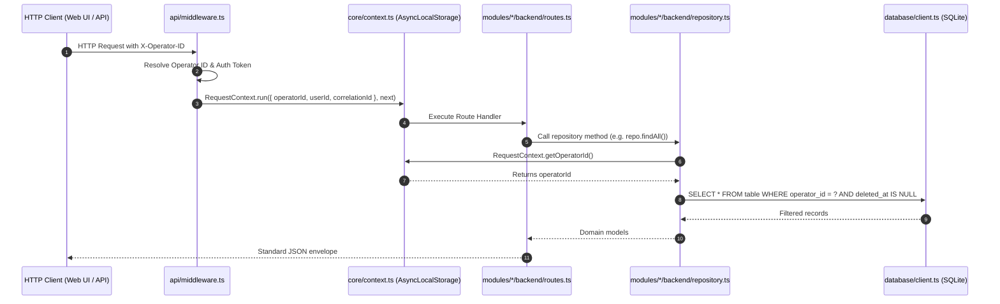

# Strict Multi-Operator Isolation & Domain Tenancy
 
GarrisonOS is architected from first principles to guarantee strict logical multi-operator isolation while eliminating conceptual confusion with real-estate rental tenants.
 
---

## 1. Architectural Distinction: Operator vs. Tenant

To prevent cognitive ambiguity across the software and property management domains:

| Concept | Domain | System Representation | Scope |
| :--- | :--- | :--- | :--- |
| **Operator** | Software Multi-Tenancy | `operators` table, `operator_id` FK, `RequestContext.getOperatorId()` | The management company, property management firm, or owner-operator instance. |
| **Tenant** | Real Estate Rental Domain | `contacts` (`contact_type = 'tenant'`), `lease_contacts` (`role = 'primary_tenant'`), `Tenant Ledger` | The human renter, resident, occupant, or leaseholder leasing a unit. |
| **Organization** | Commercial Entity *(Roadmap)* | Commercial property leaseholders / business entities | Reserved for commercial property management. |

---

## 2. Core Principles
 
1. **Mandatory Operator Column**: Every operational database table contains an `operator_id TEXT NOT NULL` column referencing `operators(id)`.
2. **Implicit Context Propagation**: Business logic and repositories must NEVER accept `operator_id` or `tenant_id` from client request bodies or URL route parameters. It is always resolved implicitly from `RequestContext.getOperatorId()`.
3. **Compound Operator Indexing**: Every operational table features compound indexes where `operator_id` is the leading column:
 
   ```sql
   CREATE INDEX IF NOT EXISTS idx_units_operator_property ON units(operator_id, property_id);
   CREATE INDEX IF NOT EXISTS idx_tx_operator_lease_date ON transactions(operator_id, lease_id, transaction_date);
   ```
4. **Backward Compatibility**: A SQL view `tenants` is provided mapping to `operators`, and `RequestContext.getTenantId()` acts as an alias to `RequestContext.getOperatorId()`. HTTP request headers support both `X-Operator-ID` and legacy `X-Tenant-ID`.

---

## 3. Request Lifecycle & Context Store

Context is propagated through asynchronous call chains using Node.js `node:async_hooks.AsyncLocalStorage`.



---

## 4. Code Conventions

### Request Context Access

```typescript
import { RequestContext } from '../core/context.js';

export class PropertyRepository {
  static listProperties(): Property[] {
    const operatorId = RequestContext.getOperatorId();
    
    return db.prepare(
      `SELECT * FROM properties WHERE operator_id = ? AND deleted_at IS NULL ORDER BY name ASC`
    ).all(operatorId) as Property[];
  }
}
```

### Safety Guarantees

- Attempting to access repository queries outside an active request context throws `Error('No active request context found in execution store')`.
- All SQL statements use parameterized queries to prevent SQL injection and ensure operator keys are properly bound.
- Parameter leakage checks run during CI/CD (`node scripts/check-hygiene.js`) to ensure `:operator_id` and `:tenant_id` are never present in route URLs.
