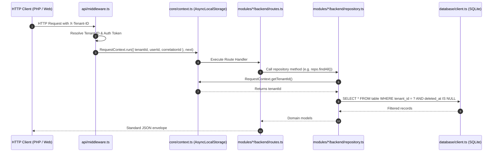

# Strict Multi-Tenancy & Row-Level Isolation

GarrisonOS is architected from first principles to guarantee strict logical multi-tenancy. Multiple real estate operators or organizations can share the same database instance while maintaining complete data isolation.

---

## 1. Core Principles

1. **Mandatory Tenant Column**: Every operational database table contains a `tenant_id TEXT NOT NULL` column referencing `tenants(id)`.
2. **Implicit Context Propagation**: Business logic and repositories must NEVER accept `tenant_id` from request bodies or URL route parameters. It is always resolved implicitly from `RequestContext.getTenantId()`.
3. **Compound Tenant Indexing**: Every operational table features compound indexes where `tenant_id` is the leading column:
   ```sql
   CREATE INDEX IF NOT EXISTS idx_units_tenant_property ON units(tenant_id, property_id);
   CREATE INDEX IF NOT EXISTS idx_tx_tenant_lease_date ON transactions(tenant_id, lease_id, transaction_date);
   ```

---

## 2. Request Lifecycle & Context Store

Context is propagated through asynchronous call chains using Node.js `node:async_hooks.AsyncLocalStorage`.



---

## 3. Code Conventions

### Request Context Access
```typescript
import { RequestContext } from '../core/context.js';

export class PropertyRepository {
  async listProperties(): Promise<Property[]> {
    const tenantId = RequestContext.getTenantId();
    
    return db.query<Property>(
      `SELECT * FROM properties WHERE tenant_id = ? AND deleted_at IS NULL ORDER BY name ASC`,
      [tenantId]
    );
  }
}
```

### Safety Guarantees
- Attempting to access repository queries outside an active request context throws `Error('No active request context found in execution store')`.
- All SQL statements use parameterized queries to prevent SQL injection and ensure tenant keys are properly bound.

