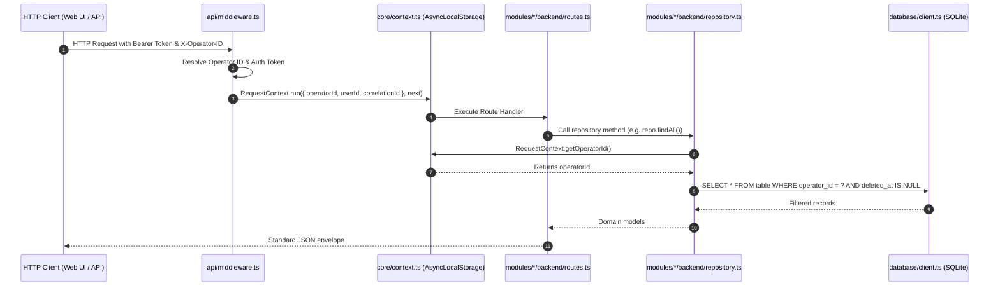

# Strict Multi-Operator Isolation & Domain Tenancy
 
GarrisonOS is architected from first principles to guarantee strict logical multi-operator isolation while eliminating conceptual confusion with real-estate rental tenants.
 
---

## 1. Architectural Distinction: Operator vs. Tenant

To prevent cognitive ambiguity across the software and property management domains:

| Concept | Domain | System Representation | Scope |
| :--- | :--- | :--- | :--- |
| **Operator** | Software Multi-Tenancy | `operators` table, `operator_id` FK, `RequestContext.getOperatorId()` | The management company, property management firm, or owner-operator instance. |
| **Tenant** | Real Estate Rental Domain | `contacts` (`contact_type = 'tenant'`), `lease_contacts` (`role = 'primary_tenant'`), `Tenant Ledger` | The human renter, resident, occupant, or leaseholder leasing a unit. |
| **Organization** | Commercial Entity *(Roadmap)* | Commercial property leaseholders / business entities | Reserved for commercial property management. |

---

## 2. Core Principles
 
1. **Mandatory Operator Column**: Every operational database table contains an `operator_id TEXT NOT NULL` column referencing `operators(id)`.
2. **Implicit Context Propagation**: Business logic and repositories must NEVER accept `operator_id` or `tenant_id` from client request bodies or URL route parameters. It is always resolved implicitly from `RequestContext.getOperatorId()`.
3. **Compound Operator Indexing**: Every operational table features compound indexes where `operator_id` is the leading column:
 
   ```sql
   CREATE INDEX IF NOT EXISTS idx_units_operator_property ON units(operator_id, property_id);
   CREATE INDEX IF NOT EXISTS idx_tx_operator_lease_date ON transactions(operator_id, lease_id, transaction_date);
   ```
4. **Zero Parameter Leakage**: Parameter leakage checks run during CI/CD (`node scripts/check-hygiene.js`) to guarantee `:operator_id` is never present in route URLs.

---

## 3. 3-Tier Organizational & Access Control Hierarchy

GarrisonOS enforces a three-tier governance architecture separating infrastructure administration, property management operations, and granular subuser duties:

```
┌─────────────────────────────────────────────────────────────┐
│                       PLATFORM PLANE                        │
│   • Master Instance Owner (system_owner)                    │
│   • System Managers ("Minions of the Owner" - system_manager)│
└──────────────┬───────────────────────────────┬──────────────┘
               │                               │
               ▼                               ▼
┌──────────────────────────────┐┌──────────────────────────────┐
│       OPERATOR PLANE A       ││       OPERATOR PLANE B       │
│  (Property Management Firm)  ││  (Property Management Firm)  │
│  • Operator Owner (owner)    ││  • Operator Owner (owner)    │
│  • Operator Manager (manager)││  • Operator Manager (manager)│
└──────────────┬───────────────┘└──────────────┬───────────────┘
               │                               │
               ▼                               ▼
┌──────────────────────────────┐┌──────────────────────────────┐
│        SUBUSER PLANE         ││        SUBUSER PLANE         │
│  • Leasing Agents            ││  • Leasing Agents            │
│  • Office Assistants         ││  • Office Assistants         │
│  • Maintenance Technicians   ││  • Maintenance Technicians   │
│  [Module & Portfolio Scoped] ││  [Module & Portfolio Scoped] │
└──────────────────────────────┘└──────────────────────────────┘
```

### 3.1 Platform Plane (`is_system_user = 1`)
- **Master Instance Owner (`system_owner`)**: Complete system authority. Can provision, configure, and soft-delete operators and platform managers. Accesses system-wide performance telemetry, error queues, and global backups.
- **Platform System Managers (`system_manager`)**: Designated platform administrators who assist the master owner with daily operations, monitoring, and cross-operator support without owner-destruction privileges.

### 3.2 Operator Plane
- **Operator Admins & Managers (`owner`, `manager`)**: Authority bounded strictly to their property management company dataset (`operator_id`). Manages client portfolios, properties, units, leases, accounting, and staff accounts.

### 3.3 Subuser Plane (Dual-Scoped Team Members)
- **Granular Roles**: `leasing_agent`, `assistant`, `maintenance`, `auditor`, `viewer`.
- **Dual Scoping**:
  - **Module Whitelist**: Only authorized business modules can be accessed.
  - **Portfolio Whitelist**: Can only read or write assets within assigned client portfolios.

---

## 4. Deployment Architecture: Single-Operator vs Multi-Operator

During first-launch setup (`/setup`), administrators select the instance deployment mode:

1. **Single-Operator Mode (`OPERATOR_MODE=single`)**:
   - Designed for private property management firms or self-managed landlords running a dedicated server or local appliance.
   - Automatically binds administrative sessions to the primary operator.
   - Streamlines navigation by eliminating unnecessary multi-company selection views.
2. **Multi-Operator Mode (`OPERATOR_MODE=multi`)**:
   - Designed for hosting multiple independent property management firms on a shared GarrisonOS instance.
   - Requires Platform Owner/Manager credentials for operator lifecycle operations (`/api/v1/system/operators`).
   - Supports path-based (`/o/:slug/...`) and subdomain-based (`:slug.garrisonos.local`) routing.

---

## 5. Request Lifecycle & Context Store

Context is propagated through asynchronous call chains using Node.js `node:async_hooks.AsyncLocalStorage`.



---

## 6. Code Conventions

### Request Context Access

```typescript
import { RequestContext } from '../core/context.js';

export class PropertyRepository {
  static listProperties(): Property[] {
    const operatorId = RequestContext.getOperatorId();
    
    return db.prepare(
      `SELECT * FROM properties WHERE operator_id = ? AND deleted_at IS NULL ORDER BY name ASC`
    ).all(operatorId) as Property[];
  }
}
```

### Safety Guarantees

- Attempting to access repository queries outside an active request context throws `Error('No active request context found in execution store')`.
- All SQL statements use parameterized queries to prevent SQL injection and ensure operator keys are properly bound.
- Parameter leakage checks run during CI/CD (`node scripts/check-hygiene.js`) to ensure `:operator_id` and `:tenant_id` are never present in route URLs.
