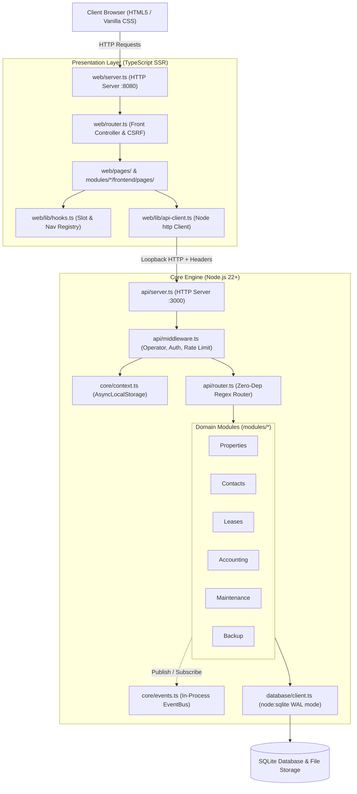

# Core Architecture Overview

GarrisonOS is structured as a decoupled, zero-dependency, 100% pure TypeScript property management system. It combines a high-performance headless Node.js backend engine with a server-rendered native TypeScript SSR presentation layer.

---

## 1. Architectural Philosophy

### Zero External Runtime Dependencies

The entire system relies exclusively on Node.js standard libraries:

* `node:http`: REST API server, SSR presentation server, and HTTP client.
* `node:sqlite`: High-speed embedded database client with WAL mode and atomic transaction management.
* `node:crypto`: RFC 9562 UUIDv7 generation, scrypt password hashing, timing-safe CSRF comparisons, and HMAC-SHA256 session token verification.
* `node:async_hooks`: `AsyncLocalStorage` for implicit operator isolation context propagation.
* `node:events`: In-process asynchronous EventBus for loosely coupled cross-module domain messaging.
* `node:fs` & `node:path`: File storage driver and dynamic module discovery.
* `node:test` & `node:assert`: Integrated testing framework.

The presentation layer executes natively in TypeScript with zero external npm packages, bundlers, or CSS preprocessors.

---

## 2. Decoupled API-First Architecture

The frontend communicates with the backend exclusively via internal loopback HTTP calls (`http://127.0.0.1:3000`).

### Benefits

1. **Security Isolation**: The web layer never opens raw database handles or constructs SQL queries directly.
2. **Headless Reusability**: The REST API engine can support native mobile clients, automated CLI utilities, or background jobs without altering presentation logic.
3. **Unified TypeScript Runtime**: The entire stack runs on a single Node.js 22.5+ runtime, eliminating multi-runtime operations and PHP dependencies.

---

## 3. Subsystem Overview

| Layer | Primary Location | Key Responsibilities |
| :--- | :--- | :--- |
| **Context Store** | [`core/context.ts`](file:///e:/projects/GarrisonOS/core/context.ts) | Stores operator ID, user ID, and correlation ID using `AsyncLocalStorage`. |
| **Cryptography** | [`core/crypto.ts`](file:///e:/projects/GarrisonOS/core/crypto.ts) | Generates RFC 9562 UUIDv7 identifiers, scrypt hashes, and HMAC tokens. |
| **Event Bus** | [`core/events.ts`](file:///e:/projects/GarrisonOS/core/events.ts) | Handles asynchronous domain event publication and subscriptions. |
| **Storage Driver** | [`core/storage.ts`](file:///e:/projects/GarrisonOS/core/storage.ts) | Manages local disk uploads with path traversal sanitization. |
| **Module Loader** | [`core/module-loader.ts`](file:///e:/projects/GarrisonOS/core/module-loader.ts) | Auto-discovers manifests, routes, migrations, and event hooks. |
| **HTTP Layer** | [`api/`](file:///e:/projects/GarrisonOS/api/) | Manages routing, rate limiting, authentication, and standard JSON envelopes. |
| **Database** | [`database/`](file:///e:/projects/GarrisonOS/database/) | SQLite client, WAL mode settings, migrations runner, and seeder. |
| **Modules** | [`modules/`](file:///e:/projects/GarrisonOS/modules/) | Self-contained domain modules (`properties`, `contacts`, `leases`, `accounting`, `maintenance`, `backup`). |
| **Presentation** | [`web/`](file:///e:/projects/GarrisonOS/web/) | TypeScript SSR templates, layouts, dynamic hook registry, and vanilla CSS. |
