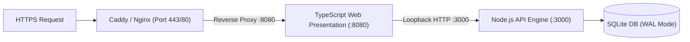

# Production Self-Hosting Guide

This guide details running GarrisonOS in a production environment using Linux system services (systemd) and a reverse proxy (Caddy or Nginx).

---

## 1. System Architecture



---

## 2. Setting Up Systemd Services

### 1. Node.js Core API Engine (`/etc/systemd/system/garrison-engine.service`)

```ini
[Unit]
Description=GarrisonOS Core Engine
After=network.target

[Service]
Type=simple
User=www-data
WorkingDirectory=/var/www/garrison-os
ExecStart=/usr/bin/node dist/api/server.js
Restart=always
EnvironmentFile=/var/www/garrison-os/.env
LimitNOFILE=65535

[Install]
WantedBy=multi-user.target
```

### 2. Node.js Web Presentation Service (`/etc/systemd/system/garrison-web.service`)

```ini
[Unit]
Description=GarrisonOS Web Presentation Layer
After=garrison-engine.service
Requires=garrison-engine.service

[Service]
Type=simple
User=www-data
WorkingDirectory=/var/www/garrison-os
ExecStart=/usr/bin/node dist/web/server.js
Restart=always
EnvironmentFile=/var/www/garrison-os/.env
LimitNOFILE=65535

[Install]
WantedBy=multi-user.target
```

### 3. Enable and Start Services

```bash
sudo systemctl daemon-reload
sudo systemctl enable --now garrison-engine garrison-web
```

---

## 3. Web Server & Reverse Proxy Configuration

### Caddy Configuration (`/etc/caddy/Caddyfile`)

```caddy
garrison.yourdomain.com {
    reverse_proxy 127.0.0.1:8080
}
```

### Nginx Configuration (`/etc/nginx/sites-available/garrison`)

```nginx
server {
    listen 80;
    server_name garrison.yourdomain.com;

    location / {
        proxy_pass http://127.0.0.1:8080;
        proxy_set_header Host $host;
        proxy_set_header X-Real-IP $remote_addr;
        proxy_set_header X-Forwarded-For $proxy_add_x_forwarded_for;
        proxy_set_header X-Forwarded-Proto $scheme;
    }
}
```

---

## 4. Production Security Hardening

1. **File Permissions**:
   - Ensure SQLite database files (`garrison.sqlite*`) and `.env` have restrictive permissions:

     ```bash
     chmod 600 garrison.sqlite* .env
     chown www-data:www-data garrison.sqlite* .env
     ```

2. **Loopback Isolation**:
   - The Node.js API engine must bind strictly to `127.0.0.1:3000` (`HOST=127.0.0.1` in `.env`). Never bind to `0.0.0.0` or expose the Node.js API port directly to the public Internet.
3. **Session Hardening**:
   - Cookie sessions are signed with HMAC-SHA256 using `APP_SECRET` and are automatically configured with `HttpOnly`, `SameSite=Strict`, and `Secure` over HTTPS.
4. **Storage Directory Outside Web Root**:
   - Ensure `STORAGE_PATH` (where attachments, receipts, and documents are saved) is placed in a dedicated directory outside the public tree (e.g. `/var/www/garrison-os/storage/uploads`).
