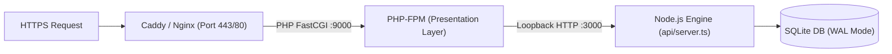

# Production Self-Hosting Guide

This guide details running GarrisonOS in a production environment using Linux system services (systemd) and a reverse proxy (Caddy or Nginx).

---

## 1. System Architecture



---

## 2. Setting Up Systemd Services

### 1. Node.js Core Backend Service (`/etc/systemd/system/garrison-engine.service`)
```ini
[Unit]
Description=GarrisonOS Core Engine
After=network.target

[Service]
Type=simple
User=www-data
WorkingDirectory=/var/www/garrison-os
ExecStart=/usr/bin/node dist/api/server.js
Restart=always
EnvironmentFile=/var/www/garrison-os/.env
LimitNOFILE=65535

[Install]
WantedBy=multi-user.target
```

### 2. Enable and Start Services
```bash
sudo systemctl daemon-reload
sudo systemctl enable --now garrison-engine
```

---

## 3. Web Server & Reverse Proxy Configuration

### Caddy Configuration (`/etc/caddy/Caddyfile`)
```caddy
garrison.yourdomain.com {
    root * /var/www/garrison-os/web
    php_fastcgi unix//run/php/php8.2-fpm.sock
    file_server

    # Block direct access to hidden files, env files, SQLite databases, and internal PHP includes
    @restricted {
        path /.*
        path *.env*
        path *.sqlite*
        path /lib/*
        path /templates/*
    }
    error @restricted 403
}
```

### Nginx Configuration (`/etc/nginx/sites-available/garrison`)
```nginx
server {
    listen 80;
    server_name garrison.yourdomain.com;
    root /var/www/garrison-os/web;
    index index.php;

    location / {
        try_files $uri $uri/ /index.php?$query_string;
    }

    location ~ \.php$ {
        include snippets/fastcgi-php.conf;
        fastcgi_pass unix:/run/php/php8.2-fpm.sock;
    }

    # Deny direct access to internal templates, includes, hidden files, env files, and SQLite databases
    location ~ ^/(lib|templates) {
        deny all;
    }

    location ~ /(\.|\.env|\.sqlite) {
        deny all;
    }
}
```

