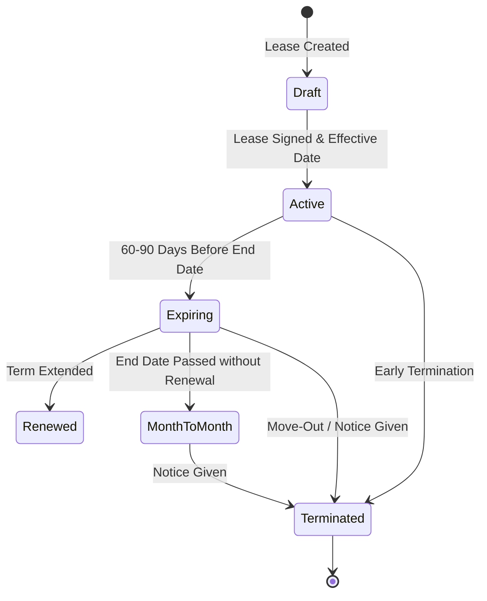

# Leases Module

The **Leases** module (`modules/leases/`) manages the residential contract lifecycle, financial terms, deposit liabilities, and multi-tenant signatory assignments.

---

## 1. Lease Lifecycle & State Machine

### Supported Statuses
* `draft`: Prepared agreement awaiting execution
* `active`: Currently in effect
* `expiring`: Reaching the end of the contractual term
* `renewed`: Superseded by renewal agreement
* `month_to_month`: Holding over post-lease term
* `terminated`: Finalized tenancy; ready for deposit disposition

---

## 2. Multi-Party Signatories (`lease_contacts`)

Residential tenancies frequently involve multiple roommates, co-signers, and non-financially responsible dependents:
* `primary_tenant`: Primary billing contact and occupant
* `co_tenant`: Co-signing resident with joint liability
* `guarantor`: Non-occupant financial guarantor
* `occupant`: Minor child or dependent without financial liability (`is_financially_responsible = 0`)

---

## 3. Financial Terms & Security Deposits

* `rent_amount_cents` (INTEGER cents): Contracted monthly recurring rent.
* `security_deposit_cents` (INTEGER cents): Total agreed deposit required.
* `deposit_held_cents` (INTEGER cents): Total cash deposit currently collected into trust.
* `rent_due_day` (INTEGER): Day of month rent is due (defaults to `1`).
* `late_fee_grace_days` (INTEGER): Grace period days before late fees apply (defaults to `5`).
* `late_fee_amount_cents` (INTEGER cents): Flat late charge applied when delinquent.

---

## 4. API Endpoints

* `GET /api/v1/leases`: List leases with status, unit, and contact filters
* `POST /api/v1/leases`: Create a new lease with signatories
* `GET /api/v1/leases/:id`: Get full lease details, signatories, terms, and current ledger balance
* `PUT /api/v1/leases/:id`: Update lease terms or status
* `POST /api/v1/leases/:id/signatories`: Add signatory to lease
* `DELETE /api/v1/leases/:id/signatories/:contactId`: Remove signatory from lease

