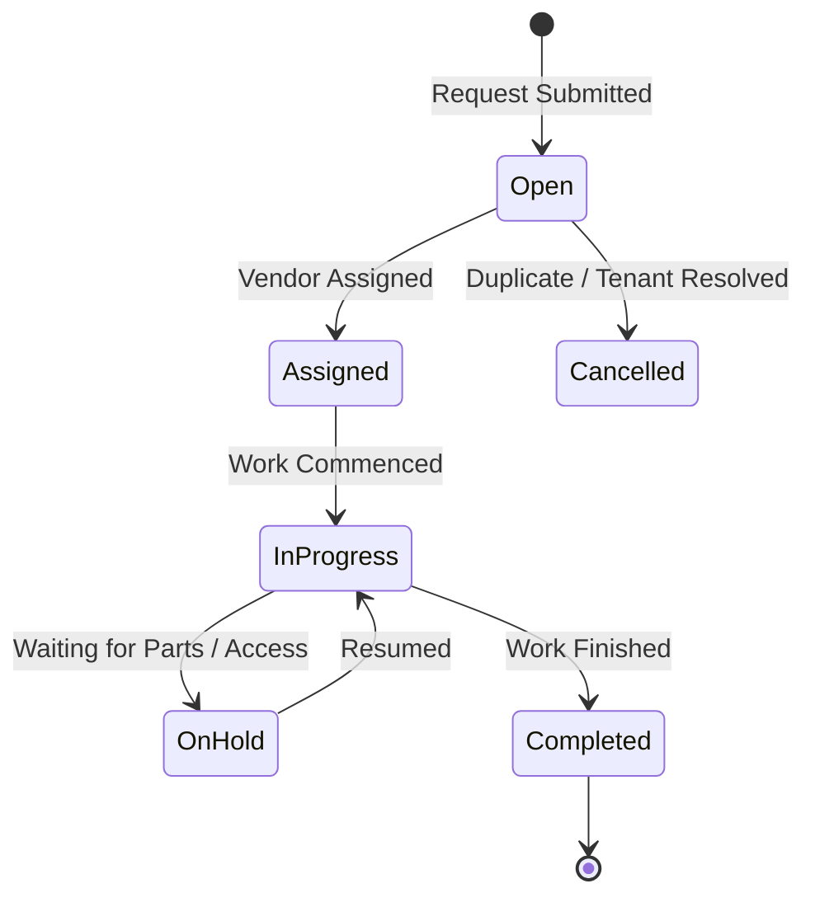

# Maintenance Module

The **Maintenance** module (`modules/maintenance/`) coordinates repair requests, vendor dispatching, priority triage, and work order lifecycle tracking.

---

## 1. Work Order Lifecycle (`work_orders`)

---

## 2. Priority & Category Matrices

### Priority Levels

* `low`: Cosmetic or non-urgent repairs (e.g., paint touch-up)
* `medium`: Standard maintenance issues (e.g., sticking door lock, running toilet)
* `high`: Functional disruption affecting tenancy (e.g., oven broken, hot water out)
* `emergency`: Urgent threat to habitability or property safety (e.g., burst pipe, gas leak, HVAC failure in winter)

### Category Types

* `plumbing`
* `electrical`
* `hvac`
* `appliance`
* `structural`
* `cosmetic`
* `pest`
* `make_ready` (Unit turnover inspections & turnover remediation)
* `other`

---

## 3. Vendor Dispatch Workflow

The maintenance module integrates with the **Contacts** vendor registry:

* **Trade-Filtered Dispatching**: When dispatching a work order, operators select from vendors verified for the relevant trade (e.g. plumbing, HVAC, electrical).
* **Compliance Safeguard**: Displays W-9 verification status directly within dispatch dialogs to prevent unauthorized work commitments with unverified contractors.
* **Status Automation**: Dispatching sets work order status to `assigned` / `in_progress` and records the dispatch timestamp.

---

## 4. Cross-Module Expense Integration

When a work order status transitions to `completed` and contains an `actual_cost_cents > 0`, the maintenance module publishes a `work_order.completed` event to the central `EventBus`.

The **Accounting** module listens for this event and can automatically record a matching `expense` transaction categorized under Schedule E `repairs` or `supplies`.

---

## 4. API Endpoints

* `GET /api/v1/maintenance`: List work orders with filter by status, priority, property, and vendor
* `POST /api/v1/maintenance`: Submit a new work order
* `GET /api/v1/maintenance/:id`: Fetch work order details and vendor contact card
* `PUT /api/v1/maintenance/:id`: Update status, priority, entry instructions, and actual cost
* `DELETE /api/v1/maintenance/:id`: Soft delete work order
